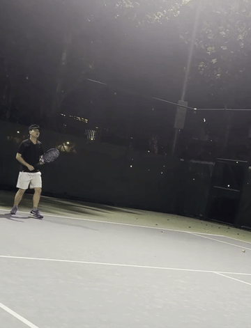
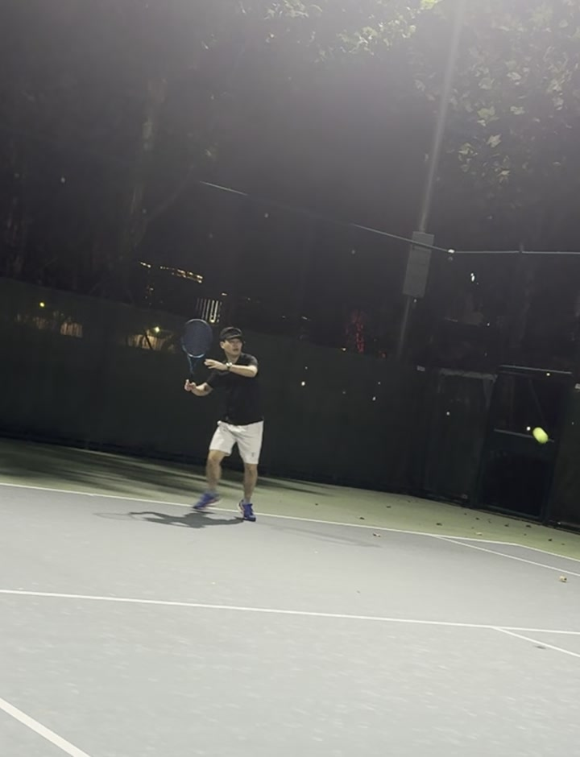
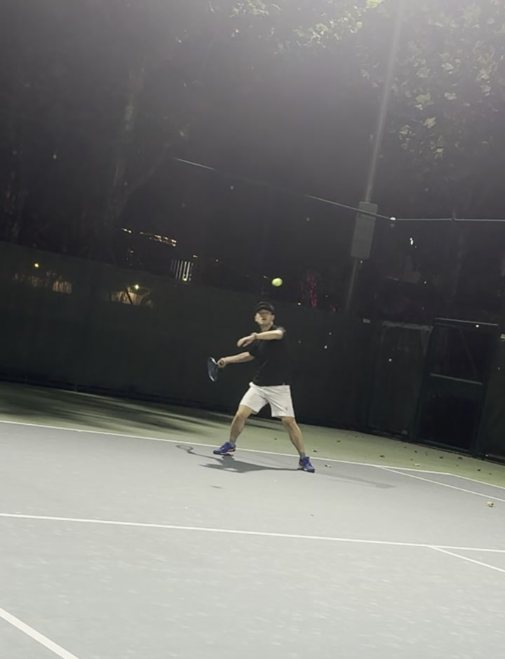
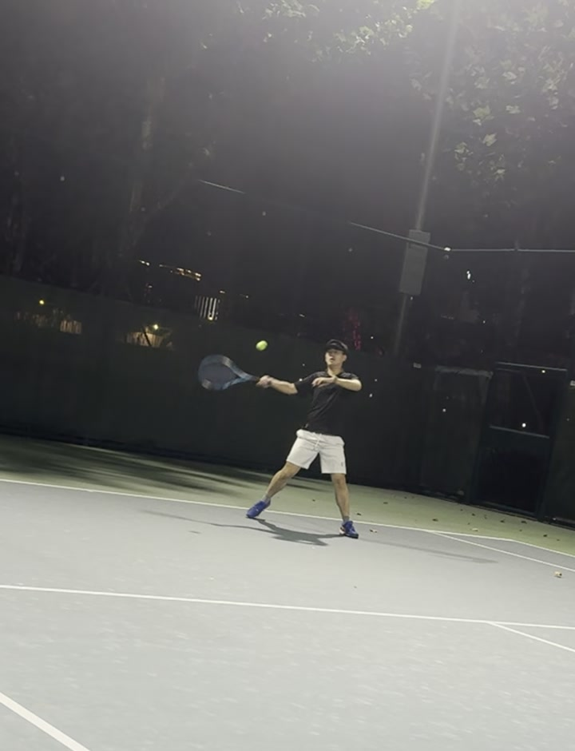
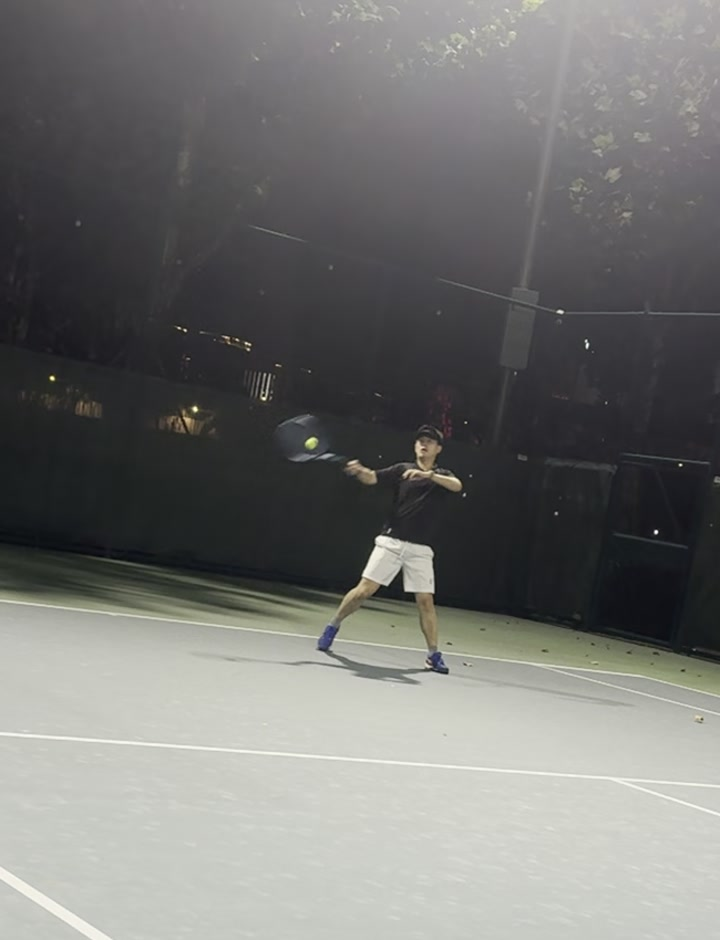
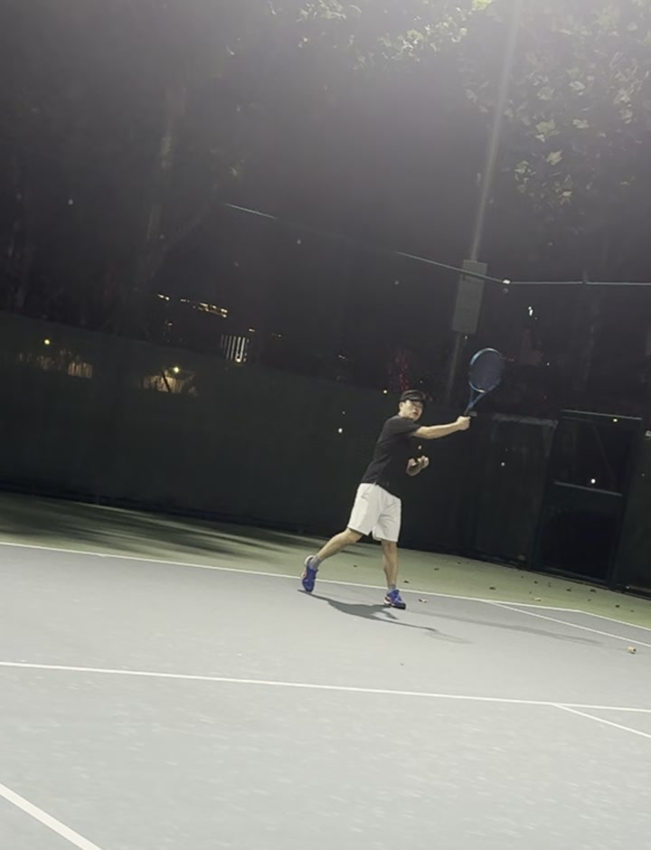

# 🎾 网球动作教练级生物力学深度诊断报告（样例）

**学员**：Clark  
**训练日期**：2026-10-07（夜间训练）  
**基准档案**：Session #01 - Baseline（初始动作基线）  
**技术动作**：右手正手抽球（Forehand Groundstroke）  
**分析基准**：第 05:48~05:52（348s~352s）击球动作序列（60 FPS 逐帧拆解）  

---

## 一、 动作动态全景

- **原始片段**：[`clip.mp4`](clip.mp4)（4 秒裁剪，H.264，约 320KB）
- **结构化数据**：[`evidence.json`](evidence.json)

---

## 二、 五大关键击球阶段逐帧拆解（Kinetic Chain 动力链）

| 阶段 1：准备预判 (`phase1_ready.jpg`) | 阶段 2：侧身转肩 (`phase2_unit_turn.jpg`) | 阶段 3：下沉蓄力 (`phase3_drop_lag.jpg`) |
| :---: | :---: | :---: |
|  |  |  |

| 阶段 4：触球瞬间 (`phase4_contact.jpg`) | 阶段 5：随挥收拍 (`phase5_finish.jpg`) |
| :---: | :---: |
|  |  |

---

## 三、 教练级关键技术指标与生物力学诊断

### 1. 优势与良好习惯（Strengths）
* **专注度极高**：击球全过程中视线始终锁死来球，头颈部在击球瞬间保持了非常出色的稳定性（没有提前仰头看球飞向哪）。
* **步法落点果断**：判断到来球后能够快速分腿并落位，站位稳固。
* **击球节奏稳定**：挥拍从启动到收拍一气呵成，动作整体流畅。

---

### 2. 核心短板与问题根源（Areas for Improvement）

#### 🔴 问题一：引拍与动力链脱节（“纯手臂挥拍”倾向明显）
* **逐帧观察**：在【阶段 2 & 3】引拍时，肩部转动角度略有不足（躯干转角约 48°，职业选手通常达 75°~90°），且右膝屈膝下沉蓄力较浅。
* **生物力学影响**：现代网球正手的力量来源于**“蹬地 -> 髋部旋转 -> 躯干扭转 -> 大臂带动小臂 -> 手腕抽打”**的动力链（Kinetic Chain）。目前你的动力主要来自**肩关节外展和小臂推力**，大肌群（下肢和核心）没有深度参与，导致球速和穿透力受限，且手臂容易疲劳。

#### 🔴 问题二：击球点略微滞后（Contact Point 偏靠身体侧后）
* **逐帧观察**：在【阶段 4】触球瞬间，球的击球点几乎与前脚（左脚）甚至身体躯干齐平，小臂与身体夹角偏小，击球手臂呈“挤压状”。
* **生物力学影响**：最佳正手击球点应在**前脚掌前方约 20~30 厘米**（身体重心前方）。击球点偏后会导致：
  1. 拍面无法在最饱满的线路上迎球；
  2. 容易将球推向边线出界，或者借不到来球向前的反弹冲力；
  3. 手腕被迫吸收过多震动冲击，增加腕管与手肘压力。

#### 🔴 问题三：随挥轨迹偏短，未充分“包球刷弧线”
* **逐帧观察**：在【阶段 5】随挥阶段，球拍在出球后很快在右胸到左肩前停滞，收拍弧度较平，拍面翻转（Windshield Wiper / 挡风玻璃刮水动作）不够充分。
* **生物力学影响**：上旋（Topspin）的安全性主要来自于击球后由低到高的快速刷球和延伸（Extension）。目前出球轨迹偏平击，过网高度容错率较低，遇到深球容易回球下网或出底线。

---

## 四、 教练处方：针对性纠正训练方案（Drills）

### 训练 1：非持拍手“指球定位”法（纠正转体与击球点）
* **动作要领**：在准备引拍时，左手（非持拍手）必须横向伸出指向来球，同时强迫左肩下颚对齐（形成 90° 转肩）。
* **效果**：锁死侧身蓄力；左手作为瞄准标尺，强迫持拍手在**左手正前方**击球，彻底解决击球点靠后问题。

### 训练 2：前腿重心转移与“向前推车”延伸感
* **动作要领**：
  1. 挥拍击球瞬间，重心必须明确从右脚压蹬并转移到左脚脚前掌；
  2. 击球后，想象球拍前部是一把剑，向前刺出 30 厘米后再顺势收拍至左肩/大臂侧下方；
* **效果**：打出深球和强穿透力，不再“缩着手打”。

### 训练 3：手腕“由低到高”挡风玻璃刷球（增强上旋保护）
* **动作要领**：在引拍最低点时，拍头下沉到球下方 15~20 厘米，击球时利用小臂内旋使球拍像雨刷器一样包裹球体向上前方刷过。
* **效果**：制造稳定的过网弧线和深区下坠上旋球。

---

## 五、 Tenniix 智能发球机专项纠错操作建议（App 精准调参指南）

针对你的 **Tenniix 智能发球机（配合 Tenniix App）**，它支持通过手机实时无极调节球速、仰角、旋转、水平摆动以及发球频率。为了把 Session #01 中发现的**“转肩蓄力”**与**“前移击球点”**彻底练出肌肉记忆，建议直接按以下 Tenniix App 参数进行设置：

---

### 1. Tenniix App 实时控制（Live Control）精准调参表

进入 Tenniix App 的 **【Live Control / 实时控制】** 或 **【Custom Mode / 自定义模式】**：

| 参数项 (App 控制滑块) | 推荐具体数值 / 档位 | 设置目的与教练意图 |
| :--- | :--- | :--- |
| **模式选择** | **Fixed Point（单点定点模式）** | 关掉水平摆角（Oscillation），不要边跑边打，专注上肢动力链 |
| **球速 (Ball Speed)** | **25% ~ 30%（约 45~50 km/h）** | ⚠️ **严禁开大球速**！球速一快身体会应激退回“纯手臂推球” |
| **仰角 (Elevation / Angle)** | **25° ~ 28°（中高弧线）** | 让球在底线前弹起至腰部到肚脐高度，制造最舒适的引拍击球窗口 |
| **水平旋转 (Horizontal Angle)** | **-10% ~ -15%（偏右侧正手区）** | 机器放对方中场，出球直接送入你右手正手击球舒适区 |
| **旋转 (Spin)** | **Topspin +10%（微弱上旋）** | 模拟真实的底线深球弹跳，严禁设为 Backspin（削球下旋） |
| **出球间隔 (Interval / Feed Rate)**| **4.0 ~ 5.0 秒 / 球** | 留足打完一球后的“还原回位、重新侧身转肩”时间 |

---

### 2. 结合 Tenniix 的 3 阶段进阶训练法

#### 阶段 A：定点“左手虚接再击球”（针对：转肩不足 48°、击球点靠后）
* **Tenniix 设置**：速度 25%，仰角 28°，间隔 4.5s，单点定点。
* **训练要领**：
  1. 听到 Tenniix 出球马达响动瞬间，**立即转肩 90°**，左手横向完全指向来球；
  2. 球反弹到身体正前方时，**先用左手在身体前侧 25cm 处“虚指”或轻碰一下**；
  3. 右手顺势在前移的击球窗完整击出。
* **训练量**：2 组 × 20 球。

#### 阶段 B：“上一步蹬地击球”（针对：下肢动力链脱节、后坐推球）
* **Tenniix 设置**：速度 30%，仰角 26°，间隔 4.0s。
* **训练要领**：
  1. 站在落点后方 1 米；
  2. 机器出球后，右脚下沉屈膝蓄力，左脚坚决向前 **Step-in 跨入**；
  3. 借身体重心压向前腿的动能将球迎击送出。
* **训练量**：3 组 × 20 球。

#### 阶段 C：Tenniix 自定义组合拉练（Custom Rally Mode）
* **Tenniix 设置**：在 App 的 **Custom / Rally Mode** 中添加两个球的交替循环：
  - 球 1：中底线深球（速度 32%，仰角 25°）-> 练习底线蹬地转肩抽球；
  - 球 2：中场浅球（速度 22%，仰角 30°）-> 练习向前移动抓前置击球点。
* **训练量**：3 组 × 15 组循环。

---

### 3. Tenniix 现场使用与拍摄技巧
1. **利用手环/语音控制（Voice Armband / App）**：Tenniix 支持手环快捷启停，打完一组 15~20 球立刻按暂停，不要疲劳硬撑；
2. **手机架设不要绑在发球机上**：发球机出球时机身有震动，手机必须独立架在三脚架上（击球者**右后方 45°，距人 3.5 米，与腰齐平**）。
* **训练量**：3 组 × 25 球。

---

---

## 六、 进阶对比基准卡（Next Session Progress Checklist）

本份报告作为 **Session #01（2026-10-07）初始基线**。下次使用发球机完成针对性训练并录制视频后，我们将重点对比以下 4 项指标的量化改善情况：

| 关键评测指标 | Session #01（2026-10-07 基线） | 下次发球机训练目标值 | 改善判定标准 |
| :--- | :--- | :--- | :--- |
| **引拍转肩角度** | 48°（较浅，手臂主导） | **≥ 75° ~ 85°** | 左肩下颚对齐，非持拍手横向伸出指向来球 |
| **击球点相对前脚** | 0 cm（与前脚掌齐平，被挤压） | **前移 20 ~ 25 cm** | 触球瞬间小臂舒展，不缩手，重心在前腿 |
| **下肢蹬地动力链** | 蓄力较浅，重心后坐 | **明确重心前移 (Step-in)** | 右脚蹬地、左脚坚决跨入，身体向前送 |
| **随挥上旋包裹** | 收拍停在胸前，弧线平短 | **完整过左肩雨刷收拍** | 出球弧线明显增高，深区下坠上旋球增多 |

